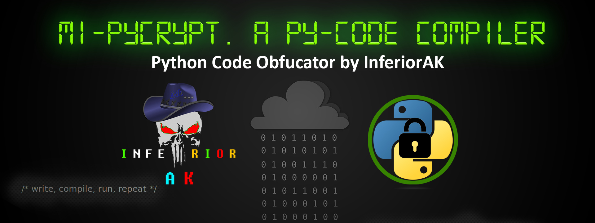
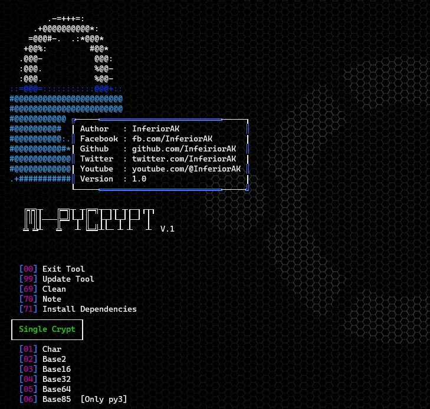
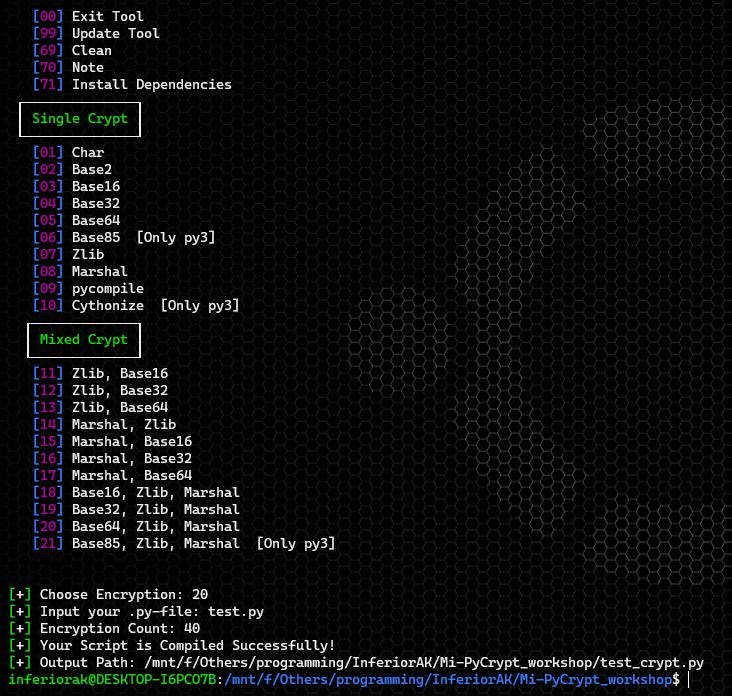

# Mi-PyCrypt



A simple Python Compiler tool works on both Python3 and Python2. Available single and Mixed Encryptions. Easy to Use, Install and Enjoy!

# Compatible with
- python2.7.x
- python3.x.x

# Supports on
- Linux
- Android
- Windows
- Mac

## [*] Installation and Usage
* `apt update && apt upgrade -y`
* `apt install python2`
* `apt install python3`
* `apt install git`
* `git clone https://github.com/InferiorAK/Mi-PyCrypt`
* `pip3 install -r requirements.txt` > For Python3
  or `pip2 install -r requirements.txt` > For Python2
* `cd Mi-PyCrypt`
* `python3 mipycrypt.py` > For Python3
  or `python2 mipycrypt.py` > For Python2
> Now Enjoy! And don't forget to follow me and Subscribe my Youtube Channel

> <b>**`Note:`</b> Don't Misuse or Sell my Codes. If you want then you can learn from it but If you want to modify my Codes, Then Give me The Credits. Don't Copy it same to same with your name. <br>---Thank You---

## [*] Overview
```

         .-=+++=:
      .+@@@@@@@@@@*:
     =@@@#-.  .:*@@@*
    +@@%:         #@@*
   .@@@-           @@@:
   :@@@.           %@@-
   :@@@.           %@@-
 ::=@@@=:::::::::::@@@+::
 #@@@@@@@@@@@@@@@@@@@@@@@
 #@@@@@@@@@@@@@@@@@@@@@@@
 #@@@@@@@@@@@ ╔─────══════════════════════════─────┐
 #@@@@@@@@@#  │ Author   : InferiorAK              ║
 #@@@@@@@@@@:.║ Facebook : fb.com/InferiorAK       │
 #@@@@@@@@@@#*│ Github   : github.com/InfeiriorAK  ║
 #@@@@@@@@@@@@║ Twitter  : twitter.com/InferiorAK  │
 #@@@@@@@@@@@@│ Youtube  : youtube.com/@InferiorAK ║
 .+###########║ Version  : 1.0                     │
              └─────══════════════════════════─────╝

    ╔╦╗┬   ╔═╗┬ ┬╔═╗┬─┐┬ ┬┌─┐┌┬┐
    ║║║│───╠═╝└┬┘║  ├┬┘└┬┘├─┘ │
    ╩ ╩┴   ╩   ┴ ╚═╝┴└─ ┴ ┴   ┴  V.1


   [00] Exit Tool
   [99] Update Tool
   [69] Clean
   [70] Note
   [71] Install Dependencies
 ┌──────────────┐
 │ Single Crypt │
 └──────────────┘
   [01] Char
   [02] Base2
   [03] Base16
   [04] Base32
   [05] Base64
   [06] Base85  [Only py3]
   [07] Zlib
   [08] Marshal
   [09] pycompile
   [10] Cythonize  [Only py3]
  ┌─────────────┐
  │ Mixed Crypt │
  └─────────────┘
   [11] Zlib, Base16
   [12] Zlib, Base32
   [13] Zlib, Base64
   [14] Marshal, Zlib
   [15] Marshal, Base16
   [16] Marshal, Base32
   [17] Marshal, Base64
   [18] Base16, Zlib, Marshal
   [19] Base32, Zlib, Marshal
   [20] Base64, Zlib, Marshal
   [21] Base85, Zlib, Marshal  [Only py3]


[+] Choose Encryption:
```

## [+] ScreenShots



## [*] Contact :
[](https://github.com/InferiorAK)
[](https://www.facebook.com/InferiorAK)
[](https://m.me/InferiorAK)
[](https://www.twitter.com/InferiorAK)
